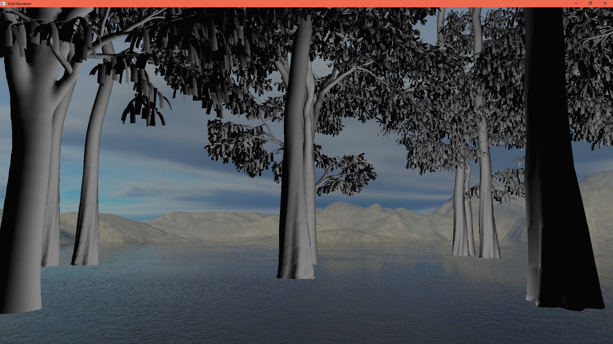

# OGLRenderer

A CPP 3D renderer implemented in OpenGL.

# POC

Features:
- [x] Model loading
- [x] PHONG lightning model
- [x] Multi Model Renderer
- [x] Entity Component System
- [x] Cubemaps and Skyboxes
- [x] Normal mapping
- [ ] Editor Layer
- [ ] Shadow mapping
- [ ] PBR Support
- [ ] Application Layer Abstraction
